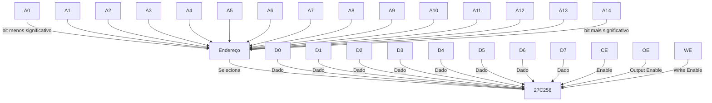
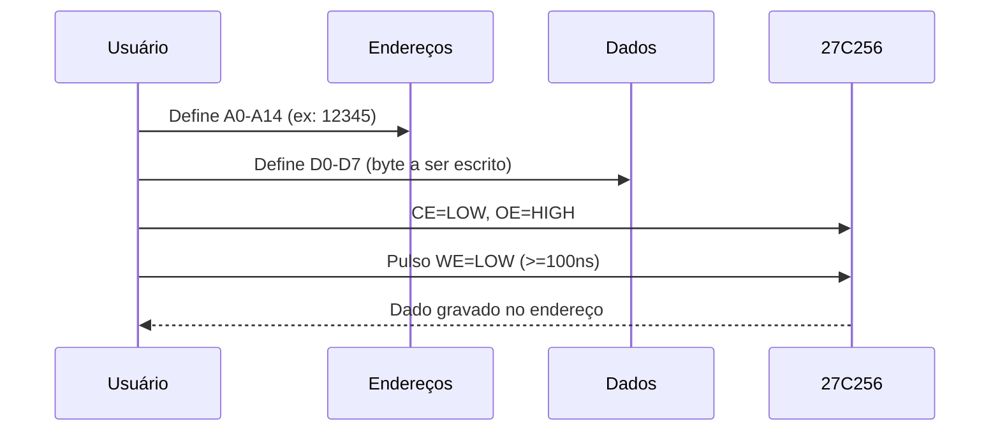

# 27C256 – Guia de Endereçamento e Escrita
#
## Exemplo de Pinagem do 27C256

```
       +---\/---+
 Vpp  -|1     28|- Vcc (+5V)
 A12  -|2     27|- A14
 A7   -|3     26|- A13
 A6   -|4     25|- A8
 A5   -|5     24|- A9
 A4   -|6     23|- A11
 A3   -|7     22|- OE (Output Enable)
 A2   -|8     21|- A10
 A1   -|9     20|- CE (Chip Enable)
 A0   -|10    19|- D7
 D0   -|11    18|- D6
 D1   -|12    17|- D5
 D2   -|13    16|- D4
 Vss  -|14    15|- D3
       +--------+
```

A 27C256 é uma memória EPROM com 15 pinos de endereço (A0 até A14), permitindo acessar:

- $2^{15} = 32.768$ endereços diferentes
- Intervalo de endereços: `0x0000` até `0x7FFF` (hexadecimal)
- Ou, em decimal: `0` até `32.767`

## Exemplo: Escrevendo um byte no endereço decimal 12345

### 1. Converter o endereço para binário

12345 (decimal) = `0011 0000 0011 1001` (binário)

### 2. Configurar os pinos de endereço (A0–A14)

|A14|A13|A12|A11|A10|A9|A8|A7|A6|A5|A4|A3|A2|A1|A0|
|---|---|---|---|---|---|---|---|---|---|---|---|---|---|---|
| 0 | 0 | 1 | 1 | 0 | 0 | 0 | 0 | 0 | 1 | 1 | 1 | 0 | 0 | 1 |

### 3. Colocar o dado a ser escrito nos pinos D0–D7

Por exemplo, usando um DIP switch.

Se quisermos gravar a letra "a" (ASCII), devemos colocar o valor binário correspondente nos pinos D0–D7:

|D7|D6|D5|D4|D3|D2|D1|D0|
|--|--|--|--|--|--|--|--|
|0 |1 |1 |0 |0 |0 |0 |1 |

Ou seja, "a" = 01100001 (binário) = 0x61 (hexadecimal) = 97 (decimal).

### 4. Configurar os sinais de controle

- **CE** (Chip Enable): LOW (habilita o chip)
- **OE** (Output Enable): HIGH (desabilita a saída)

 Esses pinos já estão conectados à VCC (HIGH) ou GND (LOW) conforme o circuito.

### 5. Executar a escrita

- Pressione o botão conectado ao pino VPP/WE (no encapsulamento da 27C256, o mesmo pino é usado para Write Enable e Programming Voltage), aplicando um pulso LOW de pelo menos 100ns durante a gravação. Este pulso ativa tanto a função de escrita (WE) quanto fornece a tensão de programação (VPP), conforme o modo de operação.
- O dado será gravado no endereço selecionado.

---

## Diagrama de Endereçamento



## Diagrama de Escrita



---

> **Observação:** Para leitura, basta colocar OE=LOW e WE=HIGH.
